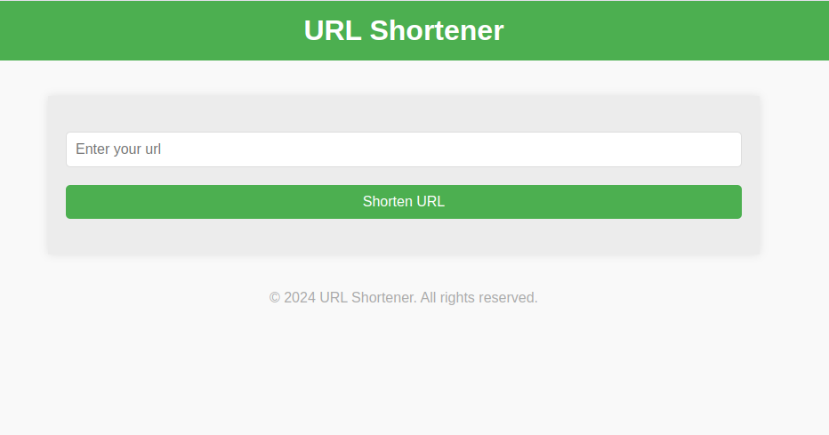

# URL Shortener

A URL shortener service built with Golang. 



Website: https://thefeij-url-shortener.liara.run

## Table of Contents

- [Introduction](#introduction)
- [Features](#features)
- [Getting Started](#getting-started)
- [Configuration](#configuration)
- [Usage](#usage)
- [API Endpoints](#api-endpoints)

## Introduction

This project is a URL shortener service implemented in Golang. It allows users to shorten long URLs and redirect to the original URLs using the shortened version.

## Features

- Shorten long URLs
- Redirect to the original URL using the shortened URL

## Usage

### Shorten a URL
Send a POST request to /links with the URL to be shortened.

Request:
```json
{
  "url": "https://www.google.com/search?q=long+url&oq=long+url&gs_lcrp=EgZjaHJvbWUyBggAEEUYOTIHCAEQABiABDIJCAIQABgKGIAEMgcIAxAuGIAEMgcIBBAuGIAEMgcIBRAAGIAEMgcIBhAAGIAEMgcIBxAAGIAEMgcICBAAGIAEMgcICRAAGIAE0gEIMTgzNmowajeoAgCwAgA&sourceid=chrome&ie=UTF-8"
}
```

Response:
```json
{
   "short_url": "https://thefeij-url-shortener.liara.run/links/VzT9h5"
}
```

### Redirect to the Original URL
Access the shortened URL in the browser or via a GET request to be redirected.

## API Endpoints
- POST /links: Shorten a URL.
- GET /links/:shortUrl: Redirect to the original URL